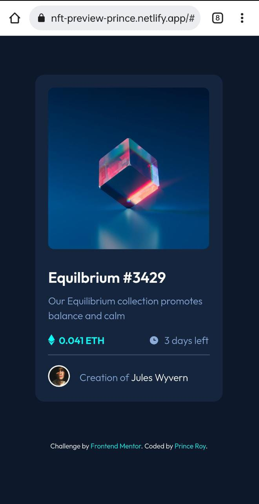
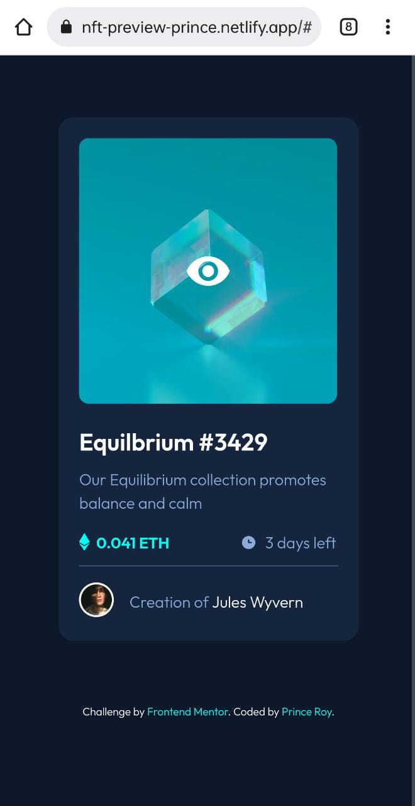

## Table of contents

-   [The challenge](#the-challenge)
-   [Screenshot](#screenshot)
-   [Links](#links)
-   [Built with](#built-with)

### The challenge

Users should be able to:

-   View the optimal layout depending on their device's screen size
-   See hover states for interactive elements

### Screenshot

### Links

-   Solution URL: [Add solution URL here](https://github.com/iprinceroyy/NFT-preview-card)
-   Live Site URL: [Add live site URL here](https://nft-preview-prince.netlify.app/)

### Built with

-   Semantic HTML5 markup
-   CSS custom properties
-   Flexbox
-   CSS Grid
-   Mobile-first workflow
